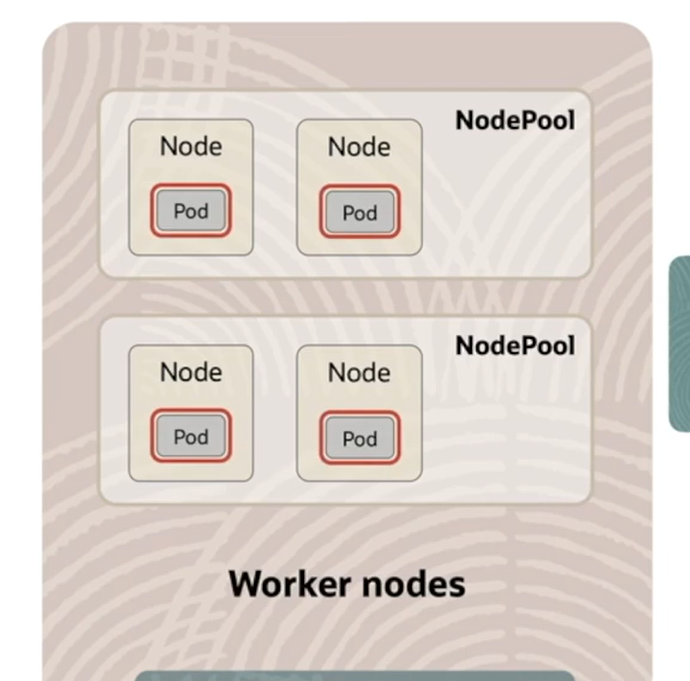
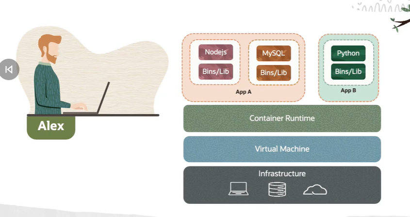
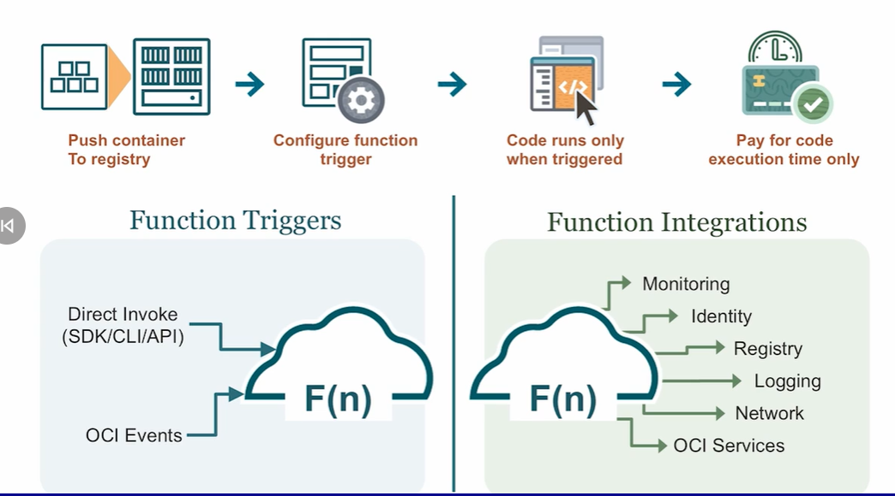
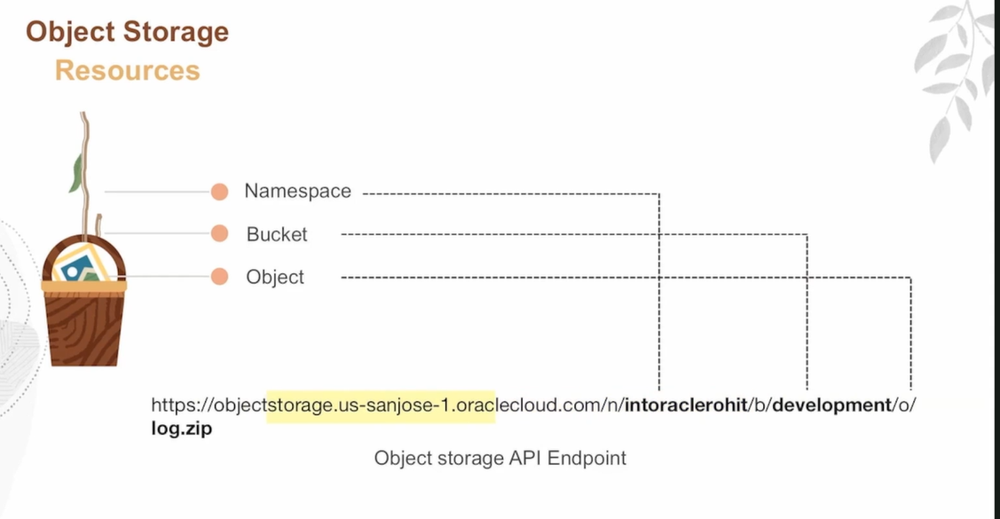
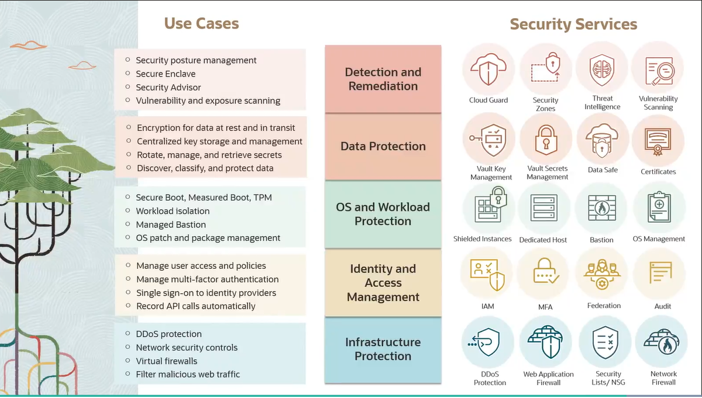
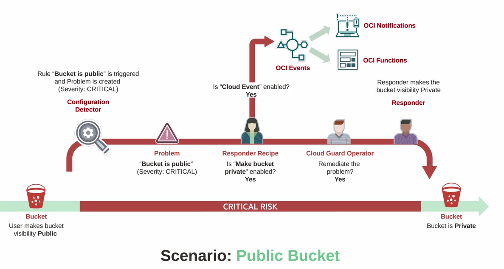
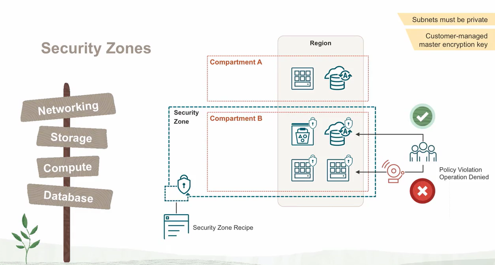
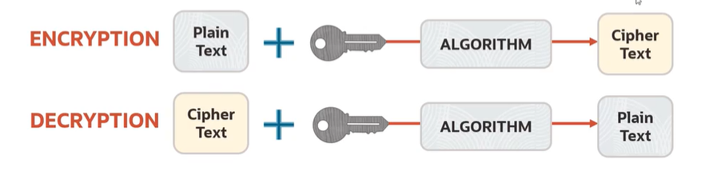
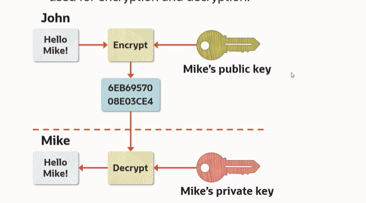

<h1 align="center">Notes - from compute section</h1>

## Control plane
1) Control plane - Handles CRUD on resources
2) Data plane - (Runtime layer) Where actually VM runs

## Live migration
Moving a VM from one physical host to another without stopping

## Getting started with cloud shell
1) click on cloud shell
2) SSH key generation 
3) mkdir .ssh --> cd .ssh --> ssh-keygen -b 4096 -t rsa -C ""
4) This ssh provides two keys - public and private keys 
5) public key must be uploaded to VM which we want to connect
6) Private key stays with the user himself

## Virtual Cloud network
* Basically it is a network in which resources communicate with each other 
* It has the IP range we call it CIDR block - 10.0.0.0/16
* Inside VCN, several subnets could be there either public or private
* There is an internet gateway which allows the traffic from the web to the public subnet where the server is located
* NAT Gateway - It is a gateway using which resources communicate inside the VCN (express <-> MongoDB) without internet

## Scaling
#### Vertical Scaling
* It is nothing but we already have a certain image and a shape(CPU, RAM, etc..)
* But the traffic is higher than we expected so we increase the CPU, RAM and basically we are enhancing the same VM instance 
* This required VM to be restarted and be unavailable for some time - DOWNTIME REQUIREMENT

#### Auto scaling or Horizontal scaling
* Adding more VM of the same shape
* More popular - No downtime required (High availability)
* Scale in and Scale out also supported

1. Instance have a config (which has metadata, info)
2. Create a stamp of the instance
3. Create an instance pool
4. Take a instance and add scaling rules

## Kubernetes Engine

* VM - It has hyperviser on top of which OS runs
* Containers  - We have a hardware on top of which we have OS and on top we have container run time like docker
* On top of that container are their which runs the app
* Since only one OS they boot faster
* Container communicates with each other with the help of kubernetes engine (Open source)
* It helps in orchestration

## OKE - Oracle Kubernetes Engine
Components of a engine

## General concept of Container based deployment
Here, we have container which are build using docker generally one for express server, mongodb server etc

Now these container are put into pods, which is an fundamental structure of a Node 

If the containers are closely coupled then, Those containers are put into same pod

These pods runs on Node (A VM but with same OS for all pods)

If i want to scale it just scale the pods - in case node's resources are limited, scale the entire node and put the pending pods there

## Virtual node 
* It is a serverless node or simply it is a scenario where containers runs on node which are managed by the providers not by you

## Managemnt node
* It is a node to manage a worker nodes

## Container instances
It allows the user to run their containerized application without having to worry about managing the servers

## Serverless with OCI
 ***Also known as Function as a service***
 

 * Pushing the container docker images into the registry and prepare the trigger script and the application runs only when it gets triggered

 <h1 align="center">OCI Storage </h1>

## OCI Storage services
### 1. Loval NVME
* ***Basically, These storage is a local storage that comes with an instance and instance uses this storage mainly to do fast operations like caching or sorting etc..***

* ***But Once VM is gone, The data is also gone***

### 2. Block Storage
* ***It is like an virtual hard disk connected with the virtual machine and these disks can be divided partitioned.***

* ***Generally, used in block volume (To boot up the OS)***

### 3. File storage
* ***It is like a drive which is shared accross many VM's i.e many VM's can perform read  or write operations on the files and directories***

### 4. Object storage
* ***It is like a virtual drive but VM can only access the data using CLI or REST API's***
* Here Data is accesses as objects
* Highly scalable and High performance
* Archive/Backup or Content Repo --> Scenarios

***Basically what you do is create an instance and store the applications data on block volume which is ultimately the hard drive of the Virtual Machine on cloud***

***But sometimes let's say the applications requires many images and videos to display, To upload high resolution images we use bucket storage***

## Block Storage - Persistant and durable storage
* Disks can be removes and attached whenever required
* You can create and attach the disks and even it can be detached so that even if i discard the VM, Data is still with me
### Block volume tiers
1. Lower cost
2. Balanced
3. High Performance (Higher cost as well)
4. Ultra High Performance

***Flow of object storage -->***
User requests images: The user sends a request to your web server to view their images.
Web server authenticates user: Your web server authenticates the user based on your app's authentication mechanism.
Web server accesses storage: The web server uses its own credentials (e.g., service account, access keys) to access the cloud storage service and retrieve the user's images.
Web server serves images: The web server then serves the images to the user.

## File storage service
Hierarchial collection of Documents organized into named Directories

1. NFS
2. SMV

The Above are the file systems provided by cloud

# Security
## Shared Security model:
* Some of the part of security is taken care by provider
* Some responsibility is on user as well
* Data, devices, endpoint are all the responsibility of user

### Security services
* Infrastructure Protection - Web application firewall, Network firewall
* IAM - Multifactor authentication - SSH etc...
* OS and Workload protection - Sheilded instances (VM with additional securities - secure boot(Only uses secure software))
* Data protection - Vault Key Management(Manages the passwords, encryptions etc..)
* Detection and Remediation - Cloud guard, security zones

## Cloud Bucket
* Helps to identify and monitor the threats in the cloud
1) Specify the target resources to be checked
2) Detectors - Identifies issues in the targeted resources
3) Problems - Issues found
4) Responders - Mitigate and solve the issues

Example : 

## Security zones and Security Advisor

1) Security zones :

Making a compartment made secure to ensure the overall security

2) Security Advisor :
It provides the efficient threat-free workflow with some recommendations

## Encryption
* Transform a plain text into Cipher text

1) Assymetric Encryption :
Here for encryption, we use public key but only for decryption private key is required
  

* Hardware Security Module(HSM) : It performs the encryption decryption operations 

* Vault : It uses HSM and it is a tamper resistant and if tampering detects, it deletes the keys from the device

* It is used to manage the keys and secrets so it remove the necessity to storage the secrets and keys in configs or codes

 

